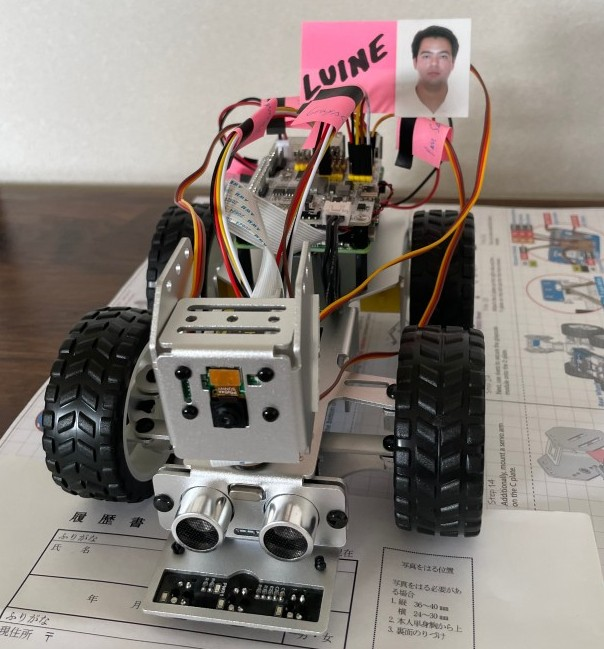

# Msc CS @ UIUC

## Software Engineer, Machine Learning Expert

## MLOps Infrastructure Engineer 

## Application Engineer

## EE <---> CS <---> ROBOTS <---> AI

### SWE -> MLOps <- MLE

#### Hi there 👋, I'm here as well:

- https://iot.cs.illinois.edu/capstone-showcase/fall-2024

- https://www.linkedin.com/in/luine-ito-madeira-de-ley

- https://www.credly.com/users/luine-ito-madeira-de-ley/badges

- https://bdm.unb.br/handle/10483/9372

- https://www.bbts.com.br/wp-content/uploads/2024/07/2015_lista_aprovados_superior.pdf

- https://github.com/litoai

### CODE 📜 Ownership, Copyright, Agreements & Licensing 🔐

- 🔒 **Proprietary & NDAs**: Code from proprietary projects cannot be displayed here due to non-disclosure agreements.
- 🤝 **Third-Party**: All external code (from companies, clients or individual contributors) is properly attributed.
- 🌱 **Open Source**: OSS code is available and shared as-is, typically under the GPL. Modifications or usage beyond the license terms cannot be attributed to this profile.
- 🔗 **Other**: Contributions to private version control systems (VCS), platforms or repositories like GitLab, and Perforce (or other, etc...) are not included in this public repository.

💡 *IP rights and licenses are respected in all projects. All contributions adhere to the respective licensing terms.*

<!--

 

 

 

 

 

-->

<!--
**DarthIt0/DarthIt0** is a ✨ _special_ ✨ repository because its `README.md` (this file) appears on your GitHub profile.

Here are some ideas to get you started:

- 🔭 I’m currently working on ...
- 🌱 I’m currently learning ...
- 👯 I’m looking to collaborate on ...
- 🤔 I’m looking for help with ...
- 💬 Ask me about ...
- 📫 How to reach me: ...
- 😄 Pronouns: ...
- ⚡ Fun fact: ...
-->
